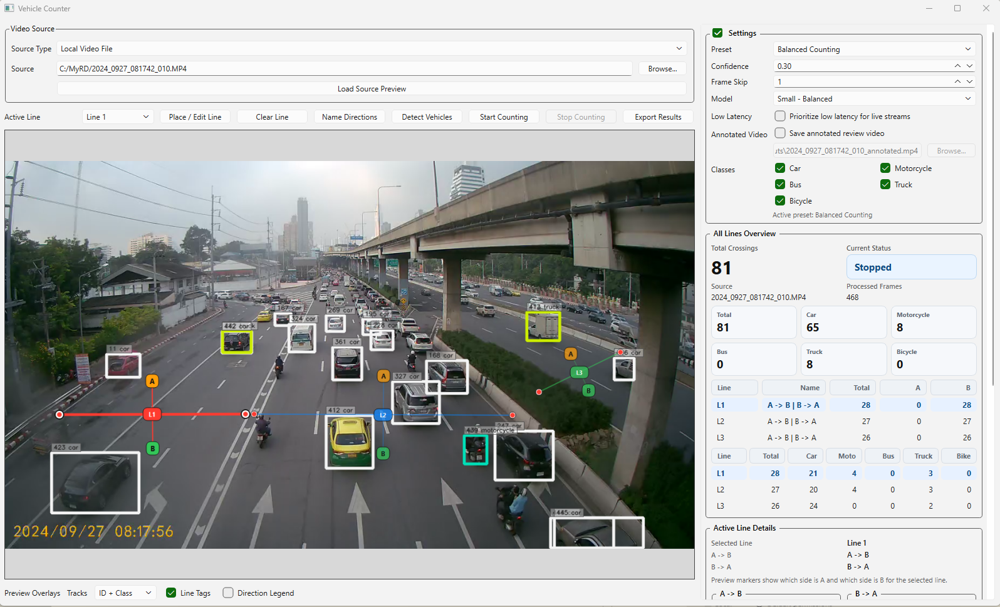

# Vehicle Counter สำหรับ Windows

โปรแกรมนับจำนวนยานพาหนะจากไฟล์วิดีโอ, ลิงก์ YouTube และลิงก์สตรีมกล้องจราจร โดยใช้ YOLO สำหรับตรวจจับและติดตามวัตถุ เหมาะสำหรับงานนับรถ การตรวจสอบทิศทางการวิ่ง และการส่งออกผลลัพธ์ไปใช้งานต่อในรูปแบบไฟล์



## ความสามารถหลัก

- เปิดไฟล์วิดีโอจากเครื่อง
- รองรับ YouTube URL
- รองรับ Direct Camera Stream URL
- วางเส้นนับได้หลายเส้น
- แยกทิศทางการวิ่งของรถ
- แสดงผลแบบสดระหว่างประมวลผล
- ส่งออกผลลัพธ์เป็น CSV / XLSX
- บันทึก annotated review video ได้
- มี preset สำหรับใช้งานง่าย เช่น Balanced Counting, Live Low Latency, Motorcycle Focus

## เหมาะกับใคร

- ผู้ที่ต้องการนับรถจากคลิปวิดีโอ
- ผู้ที่ต้องการนับรถจากกล้องจราจรหรือสตรีมภาพ
- ผู้ที่ต้องการตรวจสอบทิศทางการวิ่งของรถ
- ผู้ที่ต้องการส่งออกผลลัพธ์ไปใช้งานต่อใน Excel หรือรายงาน

## หมายเหตุ

README นี้เขียนสำหรับผู้ใช้ Windows และพยายามอธิบายแบบทีละขั้น แม้ไม่มีพื้นฐานด้านคอมพิวเตอร์มากนักก็สามารถทำตามได้

## ความต้องการของระบบ

- Windows 10 หรือ Windows 11
- Python 3.10 หรือใหม่กว่า
- อินเทอร์เน็ตในช่วงติดตั้งแพ็กเกจครั้งแรก
- ถ้าจะใช้ YouTube URL ควรมีอินเทอร์เน็ตที่เสถียร

## วิธีดาวน์โหลดโปรเจกต์จาก GitHub

### วิธีที่ 1: ดาวน์โหลดเป็น ZIP

1. เปิดหน้า GitHub ของโปรเจกต์
2. กดปุ่ม `Code`
3. กด `Download ZIP`
4. แตกไฟล์ ZIP ไปไว้ในโฟลเดอร์ที่ต้องการ เช่น `C:\vehicle-counter`

### วิธีที่ 2: ใช้ git clone

วิธีนี้เหมาะกับคนที่ติดตั้ง Git ไว้แล้ว

```powershell
git clone <repo-url>
cd <repo-folder>
```

แทน `<repo-url>` ด้วยลิงก์ GitHub จริงของโปรเจกต์ และแทน `<repo-folder>` ด้วยชื่อโฟลเดอร์ที่ถูกสร้างหลัง clone

## วิธีติดตั้ง Python บน Windows

ถ้ายังไม่มี Python ให้ทำตามนี้

1. เปิดเว็บ: https://www.python.org/downloads/windows/
2. ดาวน์โหลด Python เวอร์ชันใหม่ล่าสุด
3. เปิดไฟล์ติดตั้ง
4. สำคัญมาก: ให้ติ๊ก `Add Python to PATH`
5. กดติดตั้งตามขั้นตอนจนเสร็จ

หลังติดตั้งเสร็จ แนะนำให้ปิดแล้วเปิด PowerShell หรือ Command Prompt ใหม่อีกครั้ง

## ติดตั้งแบบง่ายสำหรับผู้เริ่มต้น

ถ้าคุณโหลดโปรเจกต์มาเรียบร้อยแล้ว ให้ลองวิธีนี้ก่อน

1. เข้าไปในโฟลเดอร์โปรเจกต์
2. ดับเบิลคลิกไฟล์ `setup_windows.bat`
3. รอให้โปรแกรมสร้าง virtual environment และติดตั้งแพ็กเกจ
4. เมื่อติดตั้งเสร็จ ให้ดับเบิลคลิก `run_app.bat`

วิธีนี้เป็นวิธีที่ง่ายที่สุดสำหรับผู้ใช้ Windows ทั่วไป

## ติดตั้งแบบทีละขั้นด้วย PowerShell

ถ้าคุณต้องการทำเองทีละขั้น ให้เปิด PowerShell ในโฟลเดอร์โปรเจกต์ แล้วทำตามนี้

### 1. เข้าโฟลเดอร์โปรเจกต์

```powershell
cd C:\path\to\your\project
```

### 2. สร้าง virtual environment

```powershell
python -m venv .venv
```

ถ้าเครื่องคุณใช้ `py` แทน `python` ให้ใช้:

```powershell
py -3 -m venv .venv
```

### 3. เปิดใช้งาน virtual environment

```powershell
.venv\Scripts\activate
```

ถ้าสำเร็จ มักจะเห็นคำว่า `(.venv)` ขึ้นหน้าบรรทัดคำสั่ง

### 4. ติดตั้งแพ็กเกจที่จำเป็น

```powershell
pip install -r requirements.txt
```

### 5. เปิดโปรแกรม

```powershell
python -m src.vehicle_counter
```

## วิธีเปิดโปรแกรมในครั้งถัดไป

### แบบง่าย

ดับเบิลคลิก `run_app.bat`

### แบบใช้ PowerShell

```powershell
cd C:\path\to\your\project
.venv\Scripts\activate
python -m src.vehicle_counter
```

## วิธีใช้งานโปรแกรมแบบทีละขั้น

### 1. เลือกแหล่งวิดีโอ

ในส่วน `Source Type` คุณสามารถเลือกได้ เช่น

- `Local Video File` สำหรับไฟล์วิดีโอในเครื่อง
- `YouTube URL` สำหรับลิงก์ YouTube
- `Direct Camera Stream URL` สำหรับลิงก์กล้องหรือสตรีมโดยตรง

### 2. โหลดภาพตัวอย่าง

- ถ้าเป็นไฟล์ในเครื่อง ให้กดเลือกไฟล์
- ถ้าเป็น YouTube หรือสตรีม ให้ใส่ URL
- จากนั้นกด `Load Source Preview`

เมื่อสำเร็จ จะเห็นภาพตัวอย่างในหน้าพรีวิว

### 3. วางหรือแก้ไขเส้นนับ

- เลือก `Active Line` ว่าต้องการแก้ไข `Line 1`, `Line 2` หรือ `Line 3`
- กด `Place / Edit Line`
- คลิกวางเส้นบนภาพ
- หลังวางแล้ว สามารถลากปลายเส้นหรือเลื่อนทั้งเส้นเพื่อปรับตำแหน่งได้

### 4. ตั้งชื่อทิศทาง

- กด `Name Directions`
- ใส่ชื่อของ `A -> B`
- ใส่ชื่อของ `B -> A`

ตัวอย่าง:

- `A -> B = เข้าเมือง`
- `B -> A = ออกเมือง`

### 5. เลือก Preset หรือปรับค่าการนับ

ค่าเริ่มต้นของโปรแกรมคือ `Balanced Counting` ซึ่งเหมาะกับการใช้งานทั่วไป

ถ้าต้องการปรับเอง สามารถเปลี่ยน Preset หรือปรับค่าต่าง ๆ ได้ในส่วน `Settings`

### 6. เริ่มนับ

กด `Start Counting`

ระหว่างนับ:

- ภาพพรีวิวจะอัปเดต
- แดชบอร์ดด้านขวาจะอัปเดตผลแบบสด
- สามารถเปลี่ยน `Active Line` เพื่อดูรายละเอียดของเส้นอื่นได้

### 7. หยุดนับ

กด `Stop Counting`

ผลที่นับได้จนถึงตอนหยุดยังคงอยู่ และสามารถส่งออกได้

### 8. ส่งออกผลลัพธ์

กด `Export Results`

โปรแกรมจะให้เลือกบันทึกเป็น:

- `.csv`
- `.xlsx`

### 9. บันทึกวิดีโอที่มีภาพประกอบการนับ

ถ้าต้องการบันทึกวิดีโอที่มีกรอบวัตถุ เส้นนับ และข้อมูลสรุปบนภาพ

1. ไปที่ `Settings`
2. เปิด `Save annotated review video`
3. เลือกตำแหน่งไฟล์ปลายทาง
4. เริ่มนับตามปกติ

เมื่อจบการนับ จะได้วิดีโอสำหรับทบทวนย้อนหลัง

## อธิบายค่าที่สำคัญแบบง่าย

### Preset

- `Balanced Counting`
  เหมาะกับการใช้งานทั่วไป เป็นค่าที่แนะนำสำหรับผู้ใช้ส่วนใหญ่
- `Live Low Latency`
  เหมาะกับสตรีมสดที่ต้องการให้ภาพตามเวลาจริงมากขึ้น
- `Motorcycle Focus`
  เหมาะกับกรณีที่อยากเน้นการนับมอเตอร์ไซค์มากขึ้น

### Model

- `Nano - Fastest / Lightest`
  เร็วที่สุด ใช้ทรัพยากรน้อย เหมาะกับเครื่องไม่แรงมาก
- `Small - Balanced`
  สมดุลระหว่างความเร็วและความแม่นยำ เหมาะกับการใช้งานทั่วไป
- `Medium - Slower / More Accurate`
  ช้ากว่า แต่มีโอกาสแม่นยำขึ้น เหมาะกับเครื่องที่แรงพอ

### Confidence

ค่ายิ่งสูง โปรแกรมจะเข้มงวดมากขึ้นในการยอมรับการตรวจจับ

### Frame Skip

ค่ายิ่งสูง โปรแกรมจะข้ามบางเฟรมเพื่อให้ทำงานเร็วขึ้น แต่อาจพลาดบางจังหวะ

### Low Latency

- สำหรับ `Local Video File` โปรแกรมจะปิดค่านี้ให้โดยอัตโนมัติเป็นค่าเริ่มต้น
- สำหรับ `YouTube URL` และ `Direct Camera Stream URL` โปรแกรมจะเปิดค่านี้ให้โดยอัตโนมัติเป็นค่าเริ่มต้น
- คุณยังสามารถเปิดหรือปิดเองได้ตลอด

### Annotated Video

ถ้าเปิดไว้ โปรแกรมจะบันทึกวิดีโอผลลัพธ์ที่มีเส้นนับ กรอบวัตถุ และข้อมูลสรุปบนภาพ

## ปัญหาที่พบบ่อยและวิธีแก้

### 1. ดับเบิลคลิก `setup_windows.bat` แล้วไม่ทำงาน

- ตรวจสอบว่าติดตั้ง Python แล้ว
- ถ้ายังไม่ได้ติดตั้ง ให้ติดตั้งจาก https://www.python.org/downloads/windows/
- ตอนติดตั้งต้องติ๊ก `Add Python to PATH`

### 2. ขึ้นข้อความว่า `python is not recognized`

- หมายถึง Windows หา Python ไม่เจอ
- ให้ติดตั้ง Python ใหม่ แล้วติ๊ก `Add Python to PATH`
- จากนั้นปิดและเปิดหน้าต่างคำสั่งใหม่

### 3. ติดตั้งแพ็กเกจไม่สำเร็จ

ลองรัน:

```powershell
python -m pip install --upgrade pip
pip install -r requirements.txt
```

### 4. โปรแกรมเปิดไม่ได้หลังติดตั้ง

ลองรันใหม่ด้วย:

```powershell
cd C:\path\to\your\project
.venv\Scripts\activate
python -m src.vehicle_counter
```

### 5. โหลด YouTube ไม่ได้

ให้ลองอัปเดต `yt-dlp`

```powershell
pip install --upgrade yt-dlp
```

### 6. โมเดล YOLO โหลดไม่ได้

- ในการใช้งานครั้งแรก โปรแกรมหรือไลบรารีอาจต้องดาวน์โหลดไฟล์โมเดล
- ตรวจสอบว่าอินเทอร์เน็ตใช้งานได้
- ไม่ควรนำไฟล์ `.pt` ขนาดใหญ่ขึ้น GitHub เว้นแต่คุณตั้งใจจะแจกไฟล์โมเดลเอง

### 7. วิดีโอหรือสตรีมช้า

- ลองใช้ `Nano` หรือ `Small`
- เพิ่ม `Frame Skip`
- ใช้ `Live Low Latency` ถ้าเป็นสตรีมสด

## การอัปเดตโปรเจกต์จาก GitHub ภายหลัง

### ถ้าคุณดาวน์โหลดแบบ ZIP

- ดาวน์โหลด ZIP ใหม่จาก GitHub
- แตกไฟล์ทับหรือย้ายไปโฟลเดอร์ใหม่
- ถ้าจำเป็น ให้รัน `setup_windows.bat` อีกครั้ง

### ถ้าคุณใช้ git clone

```powershell
git pull
```

หลังอัปเดตแล้ว แนะนำให้ติดตั้งแพ็กเกจอีกครั้งเผื่อมีการเปลี่ยนแปลง

```powershell
.venv\Scripts\activate
pip install -r requirements.txt
```

## สิ่งที่ควรและไม่ควรอัปโหลดขึ้น GitHub

### ควรอัปโหลด

- โค้ดในโฟลเดอร์ `src`
- `README.md`
- `requirements.txt`
- `setup_windows.bat`
- `run_app.bat`
- ไฟล์ตั้งค่าหรือเอกสารที่จำเป็น

### ไม่ควรอัปโหลด

- โฟลเดอร์ virtual environment เช่น `.venv`, `.venv-1`, `venv`
- ไฟล์ผลลัพธ์ เช่น `.csv`, `.xlsx`, `.mp4`, `.avi`
- โฟลเดอร์ `outputs`
- ไฟล์โมเดล เช่น `.pt`
- ไฟล์ cache ต่าง ๆ เช่น `__pycache__`

## หมายเหตุ

- ขั้นตอนนี้ยังไม่ได้แพ็กเป็น `.exe`
- ถ้าจะเผยแพร่ให้ผู้ใช้ทั่วไปมากขึ้นในอนาคต อาจค่อยทำตัวติดตั้งหรือไฟล์ `.exe` ในขั้นตอนถัดไป
